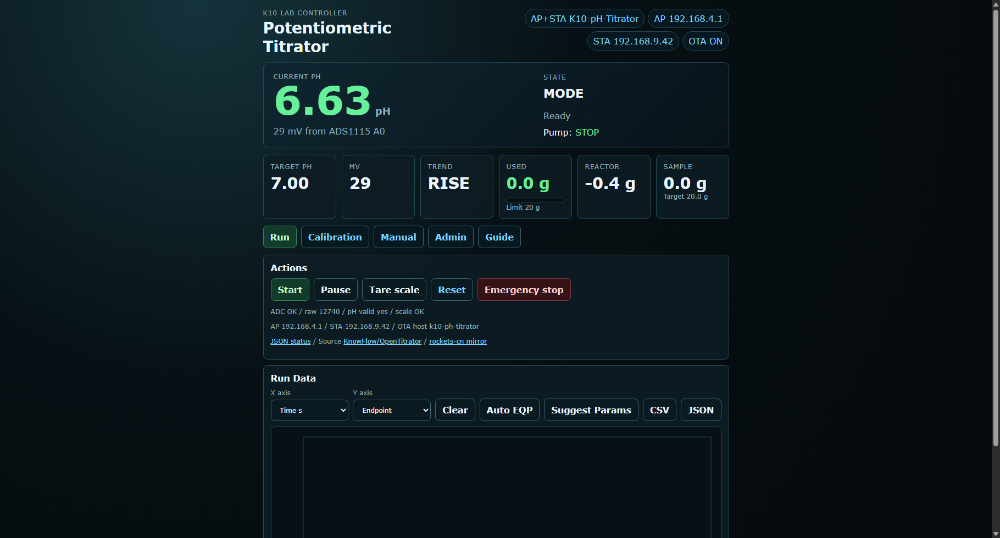
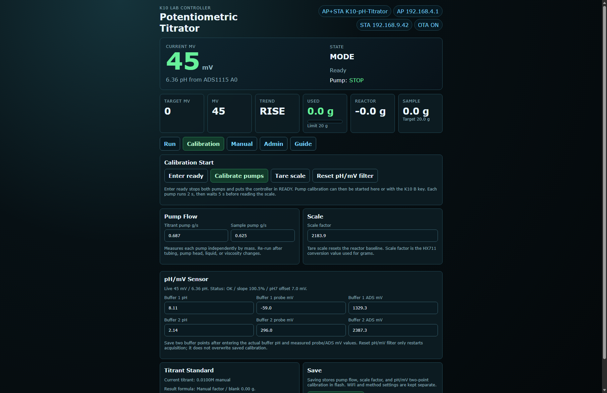
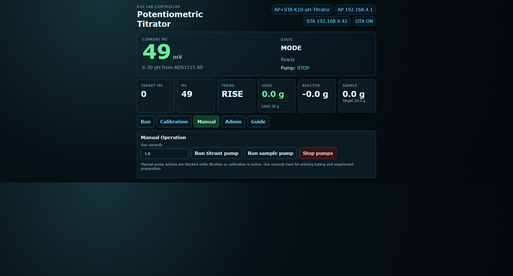
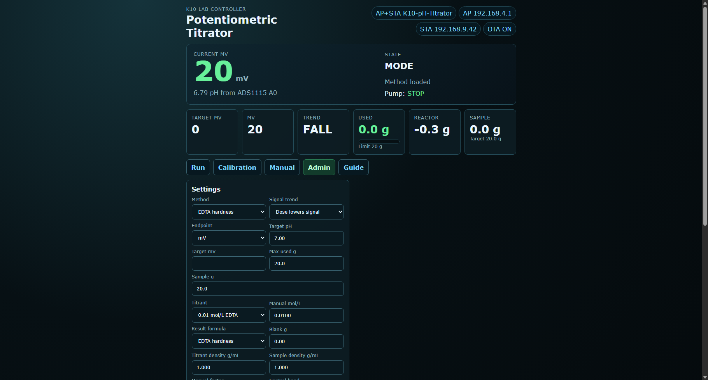
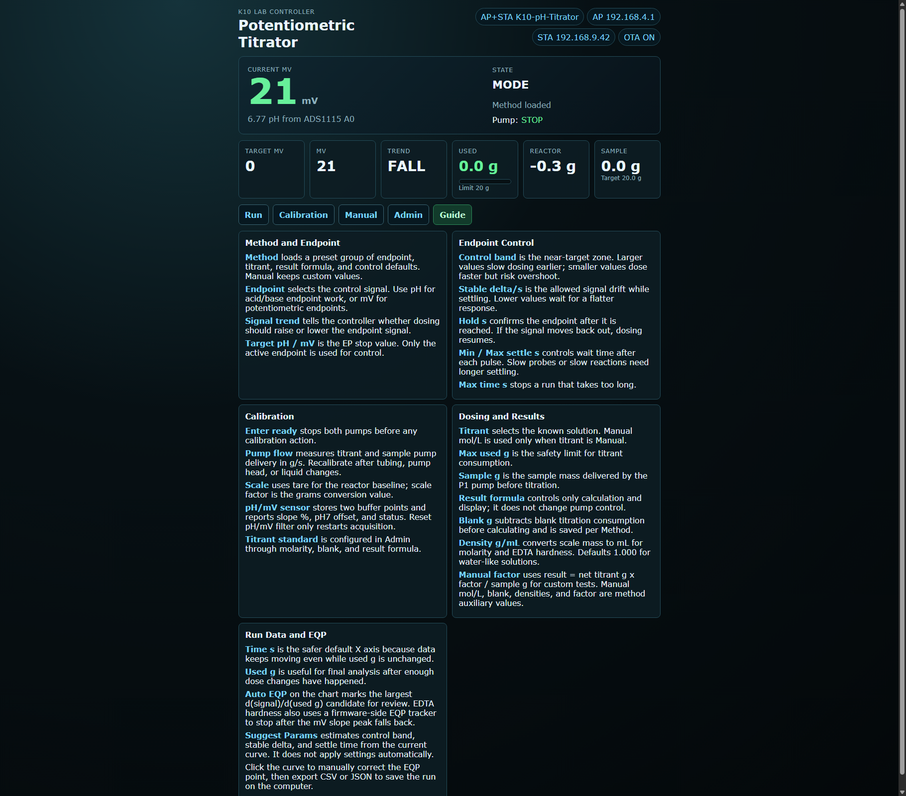

# Unihiker K10 pH Titrator

[中文](README_CN.md) · [User Manual](docs/MANUAL.md) · [使用说明书](docs/MANUAL_CN.md) · [Roadmap](docs/ROADMAP_CN.md)

A standalone pH titration controller for the **UNIHIKER K10** (ESP32-S3). It automates acid–base titration with an adaptive pure-pulse dosing strategy, dual peristaltic pumps, a pH probe with ADS1115 ADC, and an I2C electronic scale.

---

## Hardware

| Component | Interface | Address / Pin | Notes |
|-----------|-----------|---------------|-------|
| UNIHIKER K10 | — | — | Arduino core `UNIHIKER:esp32:k10` |
| ADS1115 ADC | I2C | `0x49` | pH probe on A0 |
| DFRobot KIT0176 scale | I2C | `0x64` | HX711-based, reads reactor weight |
| Titrant pump | Servo PWM | `P0` | Peristaltic pump (e.g. DFR0523) |
| Sample pump | Servo PWM | `P1` | Peristaltic pump for sample delivery |
| Pump power | External 12 V | — | Common ground with K10 |

### Wiring diagram (conceptual)

```text
K10 (3.3 V I2C)          ADS1115 (0x49)           Scale (0x64)
├─ SDA ──────────────────┬────────────────────────┬
├─ SCL ──────────────────┼────────────────────────┤
├─ GND ──────────────────┴────────────────────────┴
│
├─ P0  ──► Titrant pump servo signal
├─ P1  ──► Sample pump servo signal
└─ 12V/GND ─► Shared power rail (pumps externally powered)
```

---

## Software Highlights

### Web Screenshots

| Run | Calibration | Manual |
|-----|-------------|--------|
|  |  |  |

| Admin | Guide |
|-------|-------|
|  |  |

### Adaptive Pure-Pulse Titration
Instead of continuous PWM, the controller doses the titrant in **timed pulses** whose length and settle time adapt to how far the current pH is from the target:


The S-shaped curve above illustrates why pulse dosing works: near the steep equivalence point, even a small dose causes a large pH jump. The controller detects this via `dpH/dt` and switches to micro-pulses with longer settle times.

| Zone | Error threshold | Pulse | Settle | Purpose |
|------|----------|-------|--------|---------|
| Steep | `|dpH/dt| > 0.08` | 25 ms | 15 s | Near equivalence point, prevent overshoot |
| Far | `> controlBand × 3` | 450 ms | 5 s | Faster approach while far from endpoint |
| Medium | `> controlBand` | 150 ms | 8 s | Controlled approach |
| Near | `> controlBand × 0.33` | 60 ms | 12 s | Fine-tuning |
| Micro | `≤ controlBand × 0.33` | 25 ms | 15 s | Final micro-dose if still below endpoint |
| Endpoint | `≤ tolerance` or predictive stop | — | — | Stop, target reached |

A `TitrationDynamics` tracker watches `dpH/dt` and halts immediately if the curve shows overshoot. Each dose decision also carries its own settling interval, clamped by the configured `Min / Max settle s`, so the controller waits long enough for mixing and electrode response before reading pH again. Default pH `controlBand` is `0.30`, so Far/Medium/Near thresholds are approximately `0.90`, `0.30`, and `0.10` pH.

### Automatic Pump Calibration
From **SetupReady**, press **B** to enter calibration. The controller runs each pump for exactly 2 seconds, waits 5 seconds after each pump stops, measures the weight change on the scale, computes the flow rate (g/s), and saves it to ESP32 Preferences.

### Calibration Page
The web **Calibration** tab separates pump flow, scale, pH/mV sensor, and titrant standard settings. The pH/mV section displays two-point slope percentage, pH 7 offset, and calibration status. **Reset pH/mV filter** only restarts acquisition filtering; it does not overwrite the saved two-point calibration. Titrant molarity, blank, and result formula remain in the **Admin** tab.

### Network & Remote Control
- **AP mode** is always on (`K10-pH-Titrator` / `12345678`).
- Optional **STA WiFi** configurable from the web UI and persisted in flash.
- Responsive web dashboard with live `/json` polling (2 s).
- Browser-side titration curves with pH/mV plotting and CSV/JSON export to the computer.
- **HTTP OTA** via `POST /ota` for browser-less firmware updates.
- Arduino OTA (UDP 3232) also available.

### Safety
- Pump stops on boot, error, completion, emergency stop, and OTA start.
- Sensor-fault detection (stuck ADC values 0 or 1023) triggers emergency stop.
- Dual-stage filtering: EMA inside the pH driver + median-trimmed-mean (`PhFilter`) in the control loop.

---

## ToDo / Roadmap

The project is evolving from a pH titrator into a general potentiometric titrator. Detailed tasks are tracked in [docs/ROADMAP_CN.md](docs/ROADMAP_CN.md). Current order:

- [x] Method presets for pH, mV, EDTA hardness, and manual methods.
- [x] Parameterized EP endpoint control: control band, hold time, stability threshold, and max time.
- [x] Web-side curves: browser records `/json` data, saves on the computer, and exports CSV/JSON.
- [x] Lightweight EQP analysis: compute slope from curve data and mark the equivalence point.
- [x] Result calculation for acid/base concentration, EDTA hardness, and manual factors.
- [x] Method-level blank and auxiliary values: store blank, manual molarity, and manual factor per Method.
- [ ] Advanced features: method workflow, sample series, and reports.

---

## Quick Start

### 1. Build

```bash
arduino-cli compile --fqbn UNIHIKER:esp32:k10 ./ph_titrator
```

### 2. Upload (USB)

```bash
arduino-cli upload -p COM4 --fqbn UNIHIKER:esp32:k10 ./ph_titrator
```

### 3. Upload (HTTP OTA)

```bash
python scripts/ota_upload.py ph_titrator/build/ph_titrator.ino.bin --ip 192.168.9.42
```

### 4. Connect

Join the `K10-pH-Titrator` WiFi, open the AP IP shown on the K10 screen (usually `http://192.168.4.1/`), or use the STA IP if configured.

---

## On-Device Controls

| State | Button A | Button B | AB Short | AB Long |
|-------|----------|----------|----------|---------|
| SetupMode | Toggle mode | Toggle mode | → SetupTarget | Panic |
| SetupTarget | Target –0.05 | Target +0.05 | → SetupReady | Panic |
| SetupReady | Tare | **Calibrate** | Start titration | Panic |
| Running / Dosing / … | — | — | Pause | Panic |
| Paused | — | — | Resume | Panic |
| Calibrating | Cancel | Cancel | Cancel | Panic |
| Done / Error | — | — | Reset | Panic |

---

## Web UI Endpoints

| Endpoint | Method | Description |
|----------|--------|-------------|
| `/` | GET | Main dashboard |
| `/json` | GET | Live status JSON |
| `/set` | GET | Save settings (`mode`, `target`, `max`, `sample`, `titrant`, `titrant_m`, `ssid`, `wifi_password`) |
| `/action?cmd=` | GET | `start`, `stop`, `panic`, `tare`, `reset` |
| `/ota` | POST | Firmware binary upload |

---

## Project Structure

```
ph_titrator/
├── ph_titrator.ino      # Main sketch (state machine, web UI, display)
├── control_logic.h      # Titration math, filters, adaptive dose logic
└── partitions.csv       # 16 MB OTA partition table

tests/
├── ph_titrator_control_test.cpp         # Native C++ unit tests
└── ph_titrator_control_test/
    └── ph_titrator_control_test.ino     # Arduino-hosted unit tests

scripts/
├── ota_upload.py        # HTTP OTA helper
└── ota_upload.ps1       # PowerShell OTA helper
```

---

## License

MIT — see repository for details.
