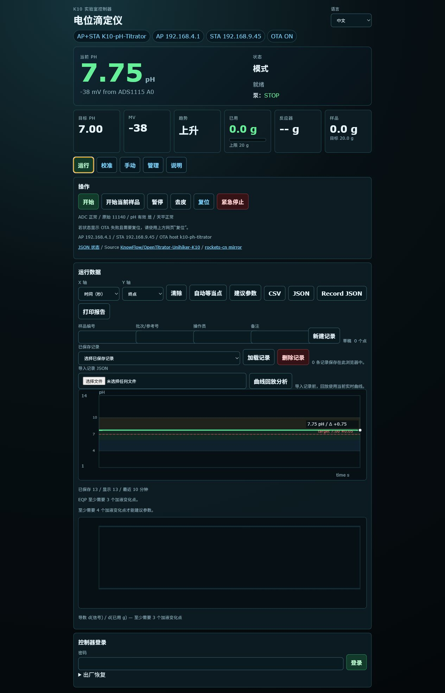
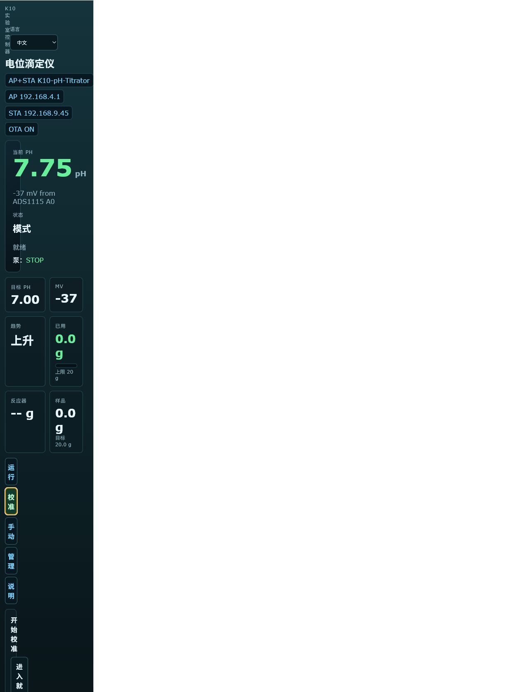
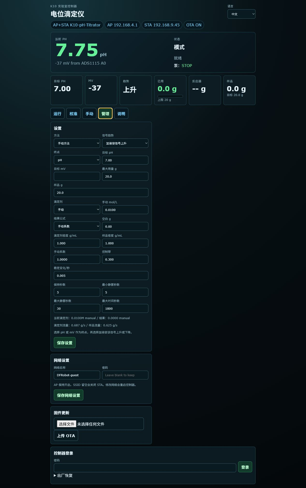
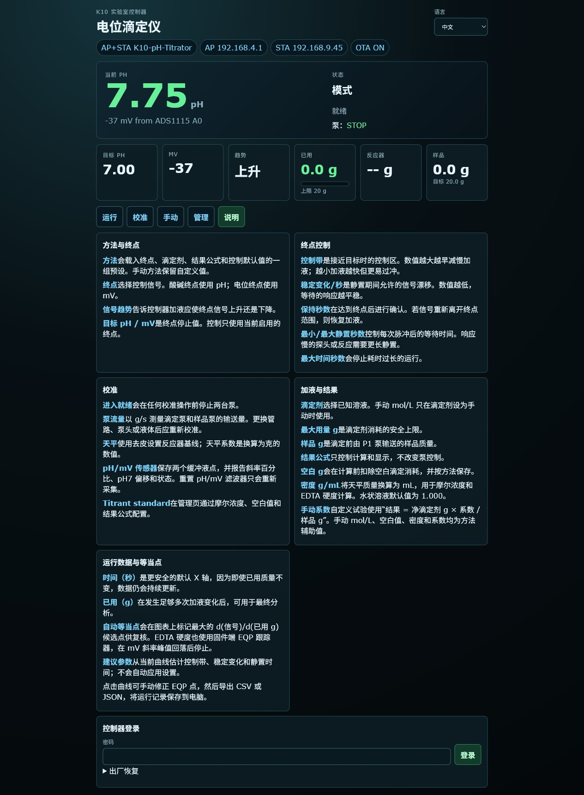

# K10 pH 滴定仪

[English](README.md) · [物料清单](docs/BOM_CN.md) · [Bill of Materials](docs/BOM.md) · [使用说明书](docs/MANUAL_CN.md) · [User Manual](docs/MANUAL.md) · [路线图](docs/ROADMAP_CN.md) · [Roadmap](docs/ROADMAP.md)

基于 **UNIHIKER K10**（ESP32-S3）的独立 pH 滴定控制器。采用自适应纯脉冲加药策略，配合双路蠕动泵、ADS1115 pH 探头和 I2C 电子秤，实现全自动酸碱滴定。

---

## 硬件

| 组件 | 接口 | 地址 / 引脚 | 说明 |
|-----------|-----------|---------------|-------|
| [UNIHIKER K10](https://www.dfrobot.com/product-2904.html) | — | — | DFRobot `DFR0992-EN`；Arduino core `UNIHIKER:esp32:k10` |
| [Gravity ADS1115 ADC](https://www.dfrobot.com/product-1730.html) | I2C | `0x49` | DFRobot `DFR0553`；pH 探头接 A0 |
| [DFRobot KIT0176 电子秤](https://www.dfrobot.com/product-2289.html) | I2C | `0x64` | DFRobot `KIT0176`；HX711 方案，读取反应瓶重量 |
| 滴定泵 | 舵机 PWM | `P0` | DFRobot 未上线新品，SKU 和链接待补充 |
| 样品泵 | 舵机 PWM | `P1` | DFRobot 未上线新品，SKU 和链接待补充 |
| 泵电源 | 外部电源 | — | 按蠕动泵工程规格选型，并与 K10 共地 |

完整数量、DFRobot 官方 SKU 和采购注意事项见[物料清单](docs/BOM_CN.md)。

### 接线示意

```text
K10 (3.3 V I2C)          ADS1115 (0x49)           电子秤 (0x64)
├─ SDA ──────────────────┬────────────────────────┬
├─ SCL ──────────────────┼────────────────────────┤
├─ GND ──────────────────┴────────────────────────┴
│
├─ P0  ──► 滴定泵舵机信号线
├─ P1  ──► 样品泵舵机信号线
└─ 泵 V+/GND ─► 外部稳压电源（按蠕动泵工程规格选型）
```

---

## 软件亮点

### 当前版本状态 — 2026-07-14

- 运行生命周期已拆分为可在主机测试的 `RunEngine`；网页外壳、页面、脚本、转义和中文翻译也已模块化。
- 所有写操作均使用带会话认证的 `POST`，并加入命令/状态权限、限流、OTA 安全锁、出厂标签恢复和 USB 管理员恢复。
- 已补齐泵计时溢出保护、看门狗/安全停泵、终点保持、校准有效性及 EQP/曲线回放测试。
- 浏览器可将已结束或中止的实验保存到 IndexedDB，支持回放分析、打印报告、CSV/JSON 导出，最多保留最近 50 条；记录不会自动写回 K10。
- 网页中英文覆盖（含运行时消息和历史记录控件）已完成，语言选择保存在当前浏览器；中文资源通过 `/i18n-zh.js` 按需加载。
- 当前开发设备已完成编译和带认证 HTTP OTA 安装；自动化测试覆盖认证、安全、运行引擎、曲线回放、本地记录和双语界面。

当前剩余重点是实机验证：用真实硬度样品调校 EDTA 自动 EQP 阈值，并在每台生产设备完成唯一凭据/标签配置和现场验收。

### 网页截图

以下截图来自设备中文界面，语言选择为“中文”。截图采用独立中文文件名，避免 GitHub 继续显示旧缓存。

| 运行 | 校准 | 手动 |
|-----|-------------|--------|
|  |  |  |

| 管理 | 说明 |
|-------|-------|
|  |  |

### 自适应纯脉冲滴定策略
控制器不再使用连续 PWM，而是根据当前 pH 与目标值的距离，自动选择**脉冲时长**和**静置等待时间**：


上图为典型的 S 型滴定曲线：接近等当点时，即使很小的加药量也会引起 pH 的大幅跃迁。控制器通过 `dpH/dt` 检测这一陡峭区，自动切换为微脉冲并延长静置时间，防止过冲。

| 区域 | 误差阈值 | 脉冲 | 静置 | 用途 |
|------|----------|-------|--------|---------|
| 陡峭区 | `|dpH/dt| > 0.08` | 25 ms | 15 s | 接近等当点，防止过冲 |
| 远区 | `> controlBand × 3` | 450 ms | 5 s | 远离终点时较快逼近 |
| 中区 | `> controlBand` | 150 ms | 8 s | 可控逼近 |
| 近区 | `> controlBand × 0.33` | 60 ms | 12 s | 精细调节 |
| 微量区 | `≤ controlBand × 0.33` | 25 ms | 15 s | 未达终点时微脉冲补加 |
| 终点 | `≤ tolerance` 或预测停泵 | — | — | 停止，已达目标 |

`TitrationDynamics` 动态追踪器实时计算 `dpH/dt`，一旦检测到过冲趋势立即停泵。每次加药决策都会携带独立的静置时间，并受网页设置中的 `Min / Max settle s` 限幅。默认 pH `controlBand` 为 `0.30`，因此远区/中区/近区阈值约为 `0.90`、`0.30`、`0.10` pH。

### 蠕动泵自动校准
在 **SetupReady（就绪）** 状态按 **B 键**进入校准。控制器依次让滴定泵和样品泵各运行 2 秒，每个泵停泵后静置 5 秒再读取重量差，计算流量（g/s）并保存到 ESP32 Preferences，掉电不丢失。

每个泵的速度可以用舵机 PWM 脉宽单独设置。默认 `1000us` 保持原有速度；越接近 `1500us` 越慢。修改 PWM 速度后应重新校准泵流量，确保 g/s 估算匹配实际出液。

### 校准页面
网页 **Calibration** tab 将校准分为泵流量、电子秤、pH/mV 传感器和滴定液标准四类。pH/mV 区域显示两点校准斜率百分比、pH 7 偏移和状态；**Reset pH/mV filter** 只重启采样滤波，不会改写已保存的两点校准。滴定液浓度、空白量和结果公式仍在 **Admin** tab 设置。

### 网络与远程控制
- **AP 热点**常开（`K10-pH-Titrator` / `12345678`）。
- 可选 **STA WiFi**，在网页设置后自动保存并重启。
- 响应式网页仪表盘，每 2 秒通过 `/json` 轮询实时数据。
- 网页端记录滴定曲线，支持 pH/mV 曲线显示和 CSV/JSON 导出到电脑。
- **HTTP OTA** 通过 `POST /ota` 上传固件，无需数据线。
- Arduino OTA（UDP 3232）同时可用。

### 安全机制
- 启动、报错、完成、紧急停止、OTA 开始时自动停泵。
- 传感器故障检测（ADC 卡死在 0 或 1023）触发紧急停止。
- 两级滤波：pH 驱动内 EMA 一阶滤波 + 控制环中值截尾平均滤波 (`PhFilter`)。

---

## ToDo / 后续路线

项目正在从 pH 滴定仪扩展为通用电位滴定仪。详见[中文路线图](docs/ROADMAP_CN.md)或[英文 Roadmap](docs/ROADMAP.md)。当前优先级：

- [x] 方法预设：保存 pH、mV、EDTA 硬度和手动方法。
- [x] EP 终点滴定参数化：控制区、滞后时间、稳定阈值、最长时间。
- [x] 网页曲线：浏览器记录 `/json` 数据，在电脑端保存并导出 CSV/JSON。
- [x] 轻量 EQP：基于曲线数据计算斜率并标记等当点。
- [x] 结果计算：支持酸碱浓度、EDTA 硬度和手动系数。
- [x] 方法级空白值和辅助值：按 Method 保存 blank、手动浓度和手动系数。
- [x] EDTA 硬度使用 mV 曲线斜率自动判断等当点。
- [x] 浏览器历史记录、回放分析、打印报告及最近 50 条持久化。
- [x] 带认证 POST 控制、出厂/USB 恢复及完整中英文网页。
- [ ] 使用真实硬度样品验证并调校 EDTA 自动 EQP。
- [ ] 每台生产设备完成唯一凭据、标签和现场安全/验收测试。
- [ ] 钙/镁两步硬度流程，以及方法流程、系列样品、报告模板和多次实验对比。

---

## 快速开始

### 1. 编译

```bash
arduino-cli compile --fqbn UNIHIKER:esp32:k10 ./ph_titrator
```

### 2. 上传（USB）

```bash
arduino-cli upload -p COM4 --fqbn UNIHIKER:esp32:k10 ./ph_titrator
```

### 3. 上传（HTTP OTA）

```bash
python scripts/ota_upload.py ph_titrator/build/ph_titrator.ino.bin --ip DEVICE_IP --token SESSION_TOKEN
```

HTTP OTA 在写入固件前会停止并锁定两路泵。更新成功后设备重启进入 SetupMode，不会恢复中断的实验；上传失败或中止后，请使用网页 Reset 复位，无需依赖 A/B 实体按键。

### 4. 连接

连接 `K10-pH-Titrator` WiFi，打开 K10 屏幕上显示的 AP IP（通常为 `http://192.168.4.1/`），或 STA IP（若已配置）。

---

## 设备按键操作

| 状态 | A 键 | B 键 | AB 短按 | AB 长按 |
|-------|----------|----------|----------|---------|
| SetupMode（模式） | 切换模式 | 切换模式 | → 设置目标 | 紧急停止 |
| SetupTarget（目标） | 目标 –0.05 | 目标 +0.05 | → 就绪 | 紧急停止 |
| SetupReady（就绪） | 去皮 | **校准** | 开始滴定 | 紧急停止 |
| 运行中 / 加药中 … | — | — | 暂停 | 紧急停止 |
| Paused（暂停） | — | — | 继续 | 紧急停止 |
| Calibrating（校准中） | 取消 | 取消 | 取消 | 紧急停止 |
| Done / Error | — | — | 复位 | 紧急停止 |

---

## Web 接口

| 地址 | 方法 | 说明 |
|----------|--------|-------------|
| `/` | GET | 主仪表盘 |
| `/json` | GET | 实时状态 JSON |
| `/set` | GET | 保存设置（`mode`, `target`, `max`, `sample`, `titrant`, `titrant_m`, `ssid`, `wifi_password`） |
| `/action?cmd=` | GET | `start` 开始、`stop` 暂停、`panic` 紧急停止、`tare` 去皮、`reset` 复位 |
| `/ota` | POST | 固件二进制上传 |

---

## 项目结构

```
ph_titrator/
├── ph_titrator.ino      # 硬件、传感器、屏幕、网页路由和适配层
├── run_engine.*         # 可测试的实验运行生命周期
├── control_logic.h      # 滴定算法、滤波器和自适应剂量逻辑
├── auth_*               # 认证、存储、加密和 USB 恢复
├── web_ui_*             # 网页、脚本、转义和翻译模块
└── partitions.csv       # 16 MB OTA 分区表

tests/                   # C++、Python、PowerShell 和浏览器 JS 测试

scripts/
├── ota_upload.*         # 带认证 HTTP OTA 脚本
├── generate_factory_auth.py
└── generate_recovery_admin.py
```

---

## 网页认证与生产配置

首次设置时，用设备标签上的唯一出厂密码登录并设置管理员密码。标签应保密，仅用于网页密码恢复；恢复会停止两台泵、清除所有会话并返回 `SetupMode`。共用电脑使用后请退出。若 30 分钟内没有成功的认证写操作，会话自动失效。

控制和设置接口现在仅接受带认证的 `POST`；旧版 `GET` 集成不兼容。OTA 同样需要当前会话令牌：`python scripts/ota_upload.py firmware.bin --ip DEVICE_IP --token SESSION_TOKEN` 或 `.\scripts\ota_upload.ps1 -Bin firmware.bin -Ip DEVICE_IP -Token SESSION_TOKEN`。脚本通过 `X-Session-Token` 请求头发送令牌且不会打印令牌。

生产时必须为每台设备单独运行 `generate_factory_auth.py`，只把对应生成头文件编译进该设备，贴上匹配标签，构建后删除两个生成文件。不得复用或提交凭据和标签。

HTTP 认证在本地网络中仍是明文，无法防御网络抓包。请使用设备自身 AP 或可信局域网。

## 许可证

MIT — 详见仓库。
