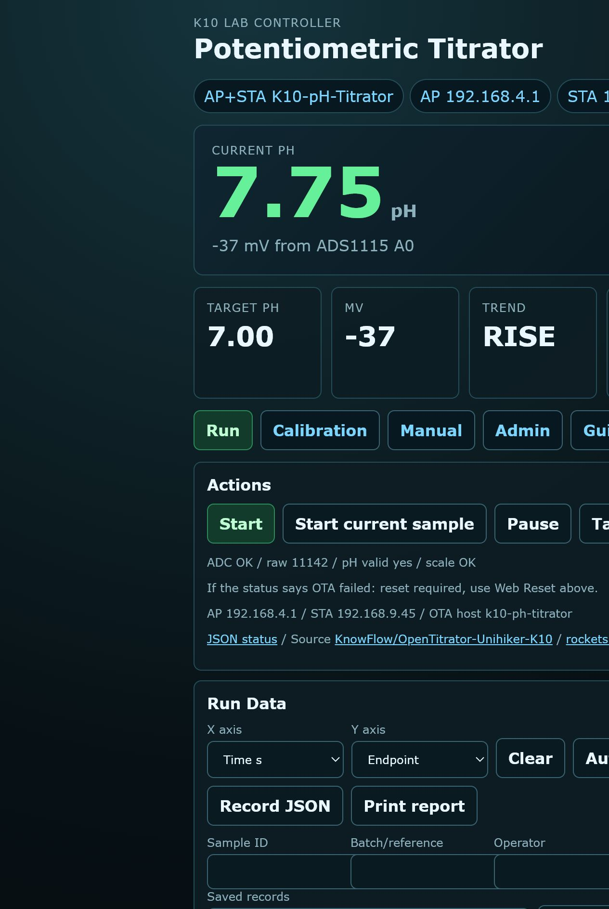
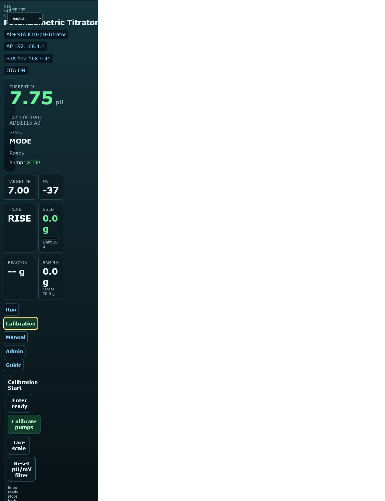
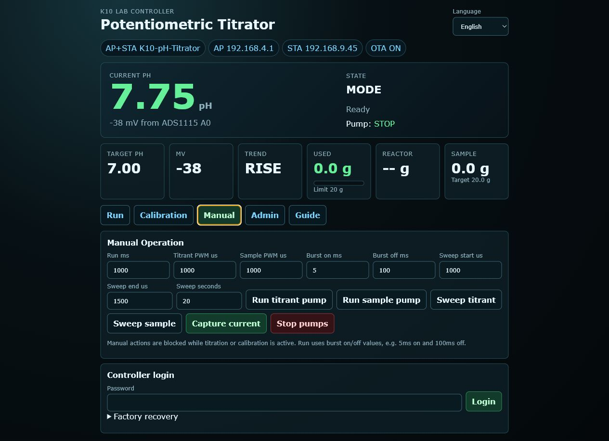
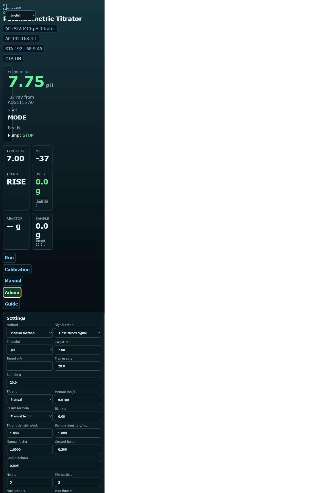
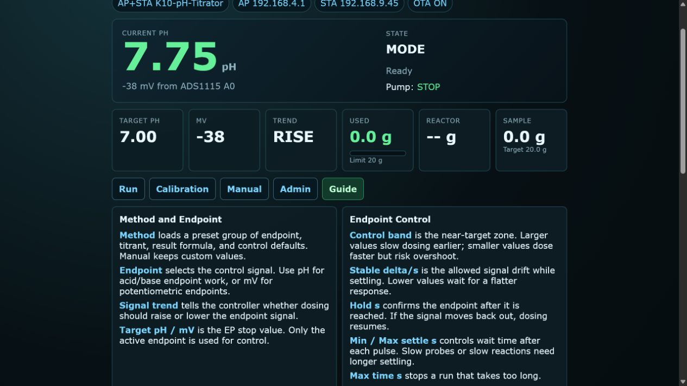

# K10 pH Titrator — User Manual

---

## Table of Contents

1. [Safety Warnings](#1-safety-warnings)
2. [What's in the Box](#2-whats-in-the-box)
3. [Assembly & Wiring](#3-assembly--wiring)
4. [First Boot](#4-first-boot)
5. [Understanding the Screen](#5-understanding-the-screen)
6. [Workflow Overview](#6-workflow-overview)
7. [Step-by-Step Operation](#7-step-by-step-operation)
   - 7.1 [Setup Mode](#71-setup-mode)
   - 7.2 [Pump Calibration](#72-pump-calibration)
   - 7.3 [Tare the Scale](#73-tare-the-scale)
   - 7.4 [Start Titration](#74-start-titration)
   - 7.5 [During Titration](#75-during-titration)
   - 7.6 [End of Titration](#76-end-of-titration)
8. [Web Dashboard](#8-web-dashboard)
9. [OTA Firmware Updates](#9-ota-firmware-updates)
10. [Troubleshooting](#10-troubleshooting)
11. [Technical Details](#11-technical-details)
12. [Authentication and Provisioning](#12-authentication-and-provisioning)

---

## 1. Safety Warnings

- **Chemical safety**: Always wear goggles and gloves when handling acids, bases, or unknown samples.
- **Electrical safety**: The K10 logic runs at 3.3 V. The pumps require a separate regulated supply matched to the installed model; DFRobot `DFR0523` requires 5–6 V. **Never** power the pumps directly from the K10 board.
- **Common ground**: The external pump power supply **must share a ground** with the K10, otherwise the PWM signal will float and pumps may behave erratically.
- **Emergency stop**: Press and hold **A+B** for ~1.2 seconds at any time to trigger an emergency stop. Both pumps will halt immediately.

---

## 2. What's in the Box

The complete ordering list is maintained in the [Bill of Materials](BOM.md), including quantities, official DFRobot links and SKUs.

| Qty. | Item | DFRobot SKU |
|---:|---|---|
| 1 | [UNIHIKER K10](https://www.dfrobot.com/product-2904.html) | `DFR0992-EN` |
| 1 | [Gravity ADS1115 16-Bit ADC Module](https://www.dfrobot.com/product-1730.html) | `DFR0553` |
| 1 | [Gravity I2C 1 kg Weight Sensor Kit](https://www.dfrobot.com/product-2289.html) | `KIT0176` |
| 2 | [Gravity Digital Peristaltic Pump](https://www.dfrobot.com/product-1698.html) | `DFR0523` |
| 1 each | pH electrode/front end, reaction vessel, K10 USB-C supply and external 5–6 V pump supply | — |
| As needed | Tubing, fittings, wiring, buffer solutions, titrant and PPE | — |

---

## 3. Assembly & Wiring

### 3.1 I2C Bus
Connect SDA and SCL from the K10 to **both** the ADS1115 and the scale module. Connect all grounds together.

```
K10 3.3 V  ──► ADS1115 VCC
K10 GND    ──► ADS1115 GND  ──► Scale GND ──► Pump PSU GND
K10 SDA    ──► ADS1115 SDA  ──► Scale SDA
K10 SCL    ──► ADS1115 SCL  ──► Scale SCL
```

### 3.2 pH Probe
Plug the pH probe BNC into the ADS1115 A0 channel adapter. The ADS1115 address is fixed at `0x49`.

### 3.3 Pumps
- **Titrant pump** signal → `P0`
- **Sample pump** signal → `P1`
- Pump power comes from the **external regulated supply**, not the K10. Use 5–6 V for DFRobot `DFR0523`.

### 3.4 Scale
Place the reactor vessel on the scale platform. The scale module address is `0x64`. Make sure the load cell is pre-loaded slightly so it reads a stable positive value when empty.

---

## 4. First Boot

Power the K10 via USB-C. After ~3 seconds the screen shows:

```
K10 PH TITRATOR
PH --    MV --
TARGET 7.00 BASE
USED 0.0/75G
REACTOR --
STATE MODE
AP 192.168.4.1
PULSE off  S 0.0/20.0
RESULT 0.00000M
ADC NO  SCALE NO
```

If `ADC` or `SCALE` stays on `NO`, check the I2C wiring and device addresses.

The K10 creates a WiFi AP:
- **SSID**: `K10-pH-Titrator`
- **Password**: `12345678`

Connect any phone or laptop to this AP and open the IP shown on screen (usually `http://192.168.4.1/`).

On first provisioning, sign in with the unique factory password on the private device label and set the administrator password. Later visits use the administrator password. The language selector in the page header switches the complete UI between English and Chinese and remembers the choice in this browser.

---

## 5. Understanding the Screen

| Line | Example | Meaning |
|------|---------|---------|
| 1 | `K10 PH TITRATOR` | Title |
| 3 | `PH 4.52  MV 168` | Current pH and probe millivolts |
| 4 | `TARGET 7.00 BASE` | Target pH and mode (BASE / ACID) |
| 5 | `USED 12.3/75G` | Titrant consumed / max limit |
| 6 | `REACTOR 145.2G` | Current scale reading |
| 8 | `STATE RUN` | Current state + status message |
| 9 | `AP 192.168.4.1` | Network info |
| 11 | `PULSE ON  S 15.0/20.0` | Pump running? + sample delivered / target |
| 12 | `RESULT 0.00307M` | Calculated sample concentration (mol/L) |
| 13 | `ADC OK  SCALE OK` | Sensor health |

**Bottom hints** (primary / secondary) change per state:
- `A/B SELECT` / `AB NEXT` — choose titration mode
- `A-   B+` / `AB NEXT` — adjust target pH
- `A TARE` / `AB NEXT` — ready to start
- `AB STOP` / `HOLD AB PANIC` — titration active

---

## 6. Workflow Overview

```
[Boot] → SetupMode → SetupTarget → SetupReady
                              ↓
                        [B] Calibrate (optional)
                              ↓
                        [AB] Start
                              ↓
                    SampleFilling ──► FilterWarmup ──► Running
                                                            ↓
                                    ┌───────────────────────┘
                                    ↓
                              Dosing (pulse) ──► Settling ──► Running
                                    │                              │
                                    └────── Target reached ────────┘
                                              ↓
                                            Done
```


The S-shaped titration curve shows why pulse dosing is essential: near the equivalence point the slope is extremely steep. A continuous pump would overshoot the target. The controller detects this region via `dpH/dt` and uses micro-pulses with extended settle times.

1. **SetupMode** — choose acid or base titration.
2. **SetupTarget** — set the desired endpoint pH.
3. **SetupReady** — calibrate pumps (recommended) and tare the scale.
4. **SampleFilling** — sample pump delivers the programmed sample mass.
5. **FilterWarmup** — waits for the pH reading to stabilize.
6. **Running** — evaluates pH and decides the next pulse.
7. **Dosing** — runs the titrant pump for the computed pulse duration.
8. **Settling** — waits for the reaction to equilibrate before next reading.
9. **Done** — displays the result concentration.

---

## 7. Step-by-Step Operation

### 7.1 Setup Mode

**SetupMode** (screen shows `STATE MODE`):
- Press **A** or **B** to toggle between `BASE` and `ACID`.
- Press **AB short** to confirm → enters **SetupTarget**.

**SetupTarget** (screen shows `STATE TARGET`):
- Press **A** to decrease target pH by 0.05.
- Press **B** to increase target pH by 0.05.
- Press **AB short** to confirm → enters **SetupReady**.

**SetupReady** (screen shows `STATE READY`):
- Press **A** to **tare** the scale (zero the reactor weight).
- Press **B** to enter **Calibrating** (see §7.2).
- Press **AB short** to **start titration**.

### 7.2 Pump Calibration

Calibration measures how many grams each pump delivers per second. This is saved to flash and survives reboots.

1. In **SetupReady**, press **B**.
2. Screen shows `STATE CALIB` and `Calib: place bottle + tare`.
3. Place an empty collection vessel on the scale. The scale is tared automatically at the start of calibration.
4. After 2 seconds, the **titrant pump** runs for 2 seconds.
5. After a 5-second settle, the **sample pump** runs for 2 seconds.
6. After another 5-second settle, the flow rates are calculated and saved.
7. The controller returns to **SetupReady** with status `Calibration done`.

**To cancel calibration early**: press **A**, **B**, or **AB short** during calibration.

> **Tip**: Run calibration whenever you change tubing diameter, pump head, or liquid viscosity.

### 7.3 Tare the Scale

Before each titration:
1. Place the empty reactor vessel on the scale.
2. In **SetupReady**, press **A**.
3. Status shows `Tare done`.

### 7.4 Start Titration

In **SetupReady**, press **AB short**.

The controller enters **SampleFilling**:
- The **sample pump** runs continuously until the programmed sample mass is delivered.
- Default sample mass is `20.0 g` (changeable via web UI).

When the sample mass is reached:
- The sample pump stops.
- The controller enters **FilterWarmup**, waiting for the pH signal to stabilize.

Once pH is stable, the state changes to **Running** and the titration loop begins.

If the sample is already in the reactor, use **Start existing sample** in the Web Run tab. This skips `SampleFilling`, records the configured sample amount, and enters `FilterWarmup`. Verify that the configured sample mass matches the actual sample before using this command.

### 7.5 During Titration

The controller repeatedly cycles through:

1. **Running** — reads pH, decides pulse size using `decideAdaptiveDose`.
2. **Dosing** — runs the titrant pump for the pulse duration (25–450 ms).
3. **Settling** — waits (6–15 s) for mixing and electrode response.

**You can**:
- Press **AB short** to **pause**.
- Press and hold **AB** (~1.2 s) for **emergency stop**.
- Monitor progress on the web dashboard in real time.

### 7.6 End of Titration

The titration stops automatically when any of the following occurs:

| Condition | State | Reason |
|-----------|-------|--------|
| pH within ±0.05 of target | Done | Target reached |
| `dpH/dt` shows overshoot | Done | Target reached |
| Titrant used ≥ max limit | Done / Error | Mass limit |
| pH probe fault | Error | Bad pH / SENSOR_FAULT |
| Scale disconnect | Error | Scale error |

**Result display**:
- Acid/base formula: `C_sample = C_titrant x V_titrant / V_sample`, in mol/L.
- EDTA hardness formula: `C_EDTA x V_EDTA_mL x 100.0869 x 1000 / V_sample_mL`, reported as CaCO3 mg/L.
- Scale masses are converted to volume by density: `V_titrant_mL = (mass_titrant - blank_mass) / titrant_density`, `V_sample_mL = sample_mass / sample_density`. Both densities default to `1.000 g/mL`.
- Manual formula: `result = (mass_titrant - blank_mass) × manual_factor / mass_sample` for custom experiments.

**After Done/Error**:
- Press **AB short** to reset and return to **SetupMode**.

---

## 8. Web Dashboard

Open the controller IP in a browser.

| Run | Calibration | Manual |
|-----|-------------|--------|
|  |  |  |

| Admin | Guide |
|-------|-------|
|  |  |

Read-only monitoring and **Emergency stop** remain available without signing in. Sign in before starting, pausing, resetting, calibrating, manually running pumps, saving settings, or uploading firmware. Sessions expire after 30 minutes without a successful authenticated write; sign in again if a command returns `Unauthorized`.

### Live Panel
- **Current pH / Current mV** — large display follows the active endpoint. It shows pH in pH mode and mV in mV mode.
- The secondary line shows the other signal, for example pH when mV is the active endpoint.
- **State & status** — current state machine phase.
- **Pump indicator** — `ON` (yellow) during pulses, `STOP` (green) otherwise.

### Metrics Cards
- **Target** — current endpoint target, either pH or mV.
- **mV** — probe voltage.
- **Trend** — whether dosing should make the signal rise or fall.
- **Used** — titrant mass consumed with progress bar.
- **Reactor** — current scale reading.
- **Sample** — sample mass delivered.

### Run Data Curve
- The browser polls `/json` every 2 seconds and stores the current run data in browser memory.
- The y axis defaults to the active endpoint: pH for pH methods, mV for mV methods.
- The x axis can be `Used g` or `Time s`.
- **Clear** only clears the browser-side curve data. It does not change K10 settings.
- **Auto EQP** computes the maximum `d(signal)/d(used_g)` slope between dose-change points and marks the candidate equivalence point with a yellow line and dot.
- In **EDTA hardness**, the firmware also runs an EQP tracker. It records stable mV-vs-used-g points and stops after the mV slope peak is followed by two lower-slope segments.
- Click a plotted point to manually correct the EQP candidate; click **Auto EQP** again to clear the manual correction.
- **Suggest Params** estimates `Control band`, `Stable delta/s`, and `Min / Max settle s` from the current curve. It only displays suggestions and does not change settings automatically.
- **Replay analysis** recalculates the live curve or an imported Run Record JSON. It merges duplicate delivered-mass points and uses centered local slopes to report an EQP candidate with `high`, `review`, or `insufficient` quality. It never changes the selected EQP, settings, pumps, or active run.
- Finalized completed or aborted records are saved in this browser's IndexedDB. Use **Saved records** to load, export, print, or delete them. The browser keeps the newest 50; active drafts remain memory-only, site-data clearing removes the history, and no record is uploaded to K10.
- **CSV** / **JSON** downloads the current curve data to the computer. K10 does not write curve data to flash.
- CSV / JSON exports include the current EQP candidate, signal value, and maximum slope.
- Refreshing clears an active in-memory curve, but finalized saved records remain available unless browser site data is cleared.

### Actions
- **Start / Resume** — begins or resumes titration.
- **Pause** — pauses titration.
- **Tare scale** — zeroes the scale.
- **Reset** — returns to SetupMode.
- **Emergency stop** — halts everything immediately.

### Calibration Tab
- **Enter ready**: stops both pumps and enters the READY state for calibration.
- **Calibrate pumps**: measures both pump flow rates in the sequence "titrant pump 2 s -> wait 5 s -> sample pump 2 s -> wait 5 s".
- **Pump PWM us**: saved speed for each pump. `1000us` is the original fast setting; values closer to `1500us` slow the pump toward the stop midpoint. After changing this value, run pump calibration again.
- **Tare scale**: uses the current reactor weight as the scale baseline.
- **Reset pH/mV filter**: restarts pH/mV acquisition filtering after changing probe or buffer solution. It does not overwrite the saved two-point calibration.
- **pH/mV Sensor**: enter two buffer pH values with their probe mV and ADS input mV. The page displays slope percentage, pH 7 offset, and calibration status to help decide whether the probe needs recalibration.
- **Titrant Standard**: shows the current titrant and result formula. Titrant molarity, blank, and formula are configured in the **Admin** tab; a future standardization step can calculate titrant factor from a primary standard.

### Manual Tab
- Manual pump runs can use temporary P0/P1 PWM values for speed testing. These temporary values do not change the saved defaults; save PWM values in Calibration when the tested speed is suitable.

### Settings
- **Method**: pH endpoint, mV endpoint, EDTA hardness, or Manual method. Changing a preset immediately fills the related form values.
- **Endpoint**: pH or mV control signal.
- **Signal trend**: whether dosing should raise or lower the signal.
- **Target pH / Target mV**: endpoint target.
- **Control band**: slows dosing as the signal approaches the endpoint.
- **Stable delta/s**: slope threshold used to decide whether the signal has settled.
- **Hold s**: confirmation time after the endpoint is reached.

Endpoint hold uses fresh sensor readings. Entering the endpoint range stops dosing and starts the Hold timer. If any fresh reading leaves the range, the timer resets and dosing evaluation resumes. The run finishes only after the signal remains in range for the complete Hold period.
- **Min / Max settle s**: minimum and maximum wait after each dose.
- **Max time s**: maximum titration time protection.
- **Max used g**: safety limit.
- **Sample g**: target sample mass (default 20.0 g).
- **Titrant**: 0.01 M NaOH, 0.01 M HCl, 0.01 M EDTA, or Manual with custom molarity.
- **Result formula**: acid/base concentration, EDTA total hardness (mg/L as CaCO3), or manual factor.
- **Blank g**: blank titration consumption subtracted from titrant use before calculation.
- **Titrant density g/mL / Sample density g/mL**: converts scale mass to mL for molarity and EDTA hardness calculations. Leave both at `1.000` for water-like solutions.
- **EDTA hardness automatic EQP**: this method ignores the fixed target mV as the normal stop condition and uses the mV slope peak instead; max used and max time still protect the run.
- **Manual factor**: conversion factor used by the manual result formula.
- **Auxiliary value storage**: `Manual mol/L`, `Blank g`, densities, and `Manual factor` are saved per current Method. Editing them does not switch the Method to Manual.
- **WiFi**: STA SSID and password. Saved to flash; controller restarts automatically.

### Guide Parameter Notes
- The **Guide** tab summarizes Method, Endpoint, Calibration, control band, settle timing, result formulas, Run Data, EQP, and parameter suggestions for quick reference during experiments.

> The page updates live every 2 seconds without refreshing, so form inputs are not interrupted.

---

## 9. OTA Firmware Updates

### Method A: HTTP POST (Recommended)

After compiling, upload the binary over the network:

```bash
python scripts/ota_upload.py ph_titrator/build/ph_titrator.ino.bin --ip DEVICE_IP --token SESSION_TOKEN
```

The device restarts automatically when the upload completes.

The CLI helper requires a current authenticated session token; the Web **Firmware update** form uses the current browser session automatically and is preferable for normal operation. Keep tokens out of shell history, logs, screenshots, and issue reports. The PowerShell equivalent is `.\scripts\ota_upload.ps1 -Bin firmware.bin -Ip DEVICE_IP -Token SESSION_TOKEN`.

HTTP OTA stops and locks both pumps before flash writing. A successful update restarts into SetupMode and never resumes the interrupted run. After a failed or aborted upload, use the Web Reset control; hardware A/B buttons are not required for recovery.

### Method B: Arduino OTA (IDE)

The controller advertises via mDNS as `k10-ph-titrator`. In the Arduino IDE:
1. Select **Network port** → `k10-ph-titrator at 192.168.x.x`
2. Enter password: `k10ph`
3. Upload as usual.

> **Note**: OTA triggers automatic pump stop for safety.

---

## 10. Troubleshooting

| Symptom | Cause | Fix |
|---------|-------|-----|
| Screen shows `ADC NO` | ADS1115 not detected | Check I2C wiring, verify address `0x49` |
| Screen shows `SCALE NO` | Scale module not detected | Check I2C wiring, verify address `0x64` |
| `SENSOR_FAULT` on screen | pH probe stuck at 0 or 1023 | Check probe connection, re-calibrate probe |
| Pump does not run | No external power | Verify 12 V supply, common ground |
| Pump runs continuously | PWM signal lost | Check servo wire on P0/P1 |
| Web page won't load | Wrong IP | Use the IP shown on K10 screen |
| OTA fails | Partition too small | Ensure `partitions.csv` is in the sketch folder |
| Result is `0.00000M` | Zero titrant used or sample mass | Check scale reads correctly; ensure sample was delivered |
| Titration overshoots | Settle time too short for your chemistry | Increase settle times in `control_logic.h` if needed |

---

## 11. Technical Details

### 11.1 Filter Chain

1. **EMA filter** (inside `Ads1115PhSensor`): `filtered = 0.75×old + 0.25×new` — suppresses single-sample ADC spikes.
2. **Median-trimmed-mean filter** (`PhFilter`, window 7): sorts 7 raw values, discards min/max, averages the middle 5 — removes outliers before pH calculation.

### 11.2 pH Conversion

Probe millivolts are mapped from ADS1115 input using two-point calibration:
- Alkaline reference: 1329.33 mV input → –59 mV probe → pH 8.11
- Acid reference: 2387.33 mV input → 296 mV probe → pH 2.14

### 11.3 Pulse Dose Algorithm

`decideAdaptiveDose` is called every `SAMPLE_INTERVAL_MS` (2 s) while in **Running** state:

```
if invalid pH → Error
if mass limit reached → Error
if already at target (±0.05) → Done
if overshooting (dpH/dt steep and crossed target) → Done
if still drifting toward target inside predictive stop margin → Done
if steep slope (|dpH/dt| > endpoint steep limit) → 25 ms pulse, 15 s settle
else if error > controlBand × 3 → 450 ms pulse, 5 s settle
else if error > controlBand → 150 ms pulse, 8 s settle
else if error > controlBand × 0.33 → 60 ms pulse, 12 s settle
else → 25 ms pulse, 15 s settle
```

The controller uses the settle interval returned by each dose decision before returning to **Running**. The interval is clamped by the configured `Min / Max settle s`. This slower cadence gives the reactor and pH electrode enough time to respond, reducing overshoot near the endpoint.

### 11.4 Calibration Math

```
flow_rate_gps = (weight_after - weight_before) / 2.0
pH_slope_% = abs((probe_mV_2 - probe_mV_1) / (pH_2 - pH_1)) / 59.16 x 100
pH7_offset_mV = probe_mV_1 + (7.0 - pH_1) x slope_mV_per_pH
```

Saved to Preferences namespace `cal`, keys `titrant_gps` and `sample_gps`.

### 11.5 Partition Table

The project uses a custom 16 MB partition table (`partitions.csv`) with dual OTA app partitions (~6.5 MB each) to support large firmware updates.

## 12. Authentication and provisioning

### Login and recovery

The first administrator signs in with the device-specific factory password on the private label and sets an administrator password. Logout invalidates the current session; otherwise it expires after 30 minutes without a successful authenticated write. Forgotten passwords can only be recovered in the Web interface using the factory label. Recovery stops both pumps, clears sessions and run data, and enters `SetupMode`.

Control, settings, recovery, logout, and OTA are authenticated POST-only operations, so legacy GET-based integrations must migrate. Supply the logged-in session token to OTA with `--token` (Python) or `-Token` (PowerShell); it is sent as `X-Session-Token` and must never be logged.

### USB administrator-password recovery

If the factory recovery label is lost and Web recovery is unavailable, a technician with physical USB access can flash the `unihiker-auth-recovery` image to install a new administrator credential. The image only updates the `auth` Preferences namespace; it does not erase pump calibration, pH calibration, method settings, or WiFi, and it never initializes or drives a pump.

After the recovery image prints `AUTH_RECOVERY:OK` over USB serial, immediately flash the normal `unihiker` firmware and log in with the new administrator password. Keep `recovery_admin.generated.h` local and ignored, delete it after recovery, and never put passwords, salts, derived hashes, or session tokens in Git, serial logs, or issue reports.

### Manufacturing and network security

For manufacturing, generate a unique header/label pair per serial number, compile that header into only its matching unit, apply and protect the label, then securely delete the generated files. HTTP remains local-network plaintext and cannot defeat packet sniffing; operate through the device AP or a trusted LAN.

---

*Document version: matches firmware `codex/ph-titrator` branch.*
