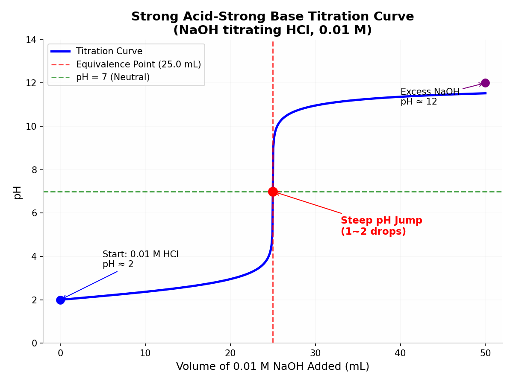

# K10 pH 滴定仪 — 使用说明书

---

## 目录

1. [安全警告](#1-安全警告)
2. [包装清单](#2-包装清单)
3. [组装与接线](#3-组装与接线)
4. [首次启动](#4-首次启动)
5. [屏幕显示说明](#5-屏幕显示说明)
6. [工作流程概览](#6-工作流程概览)
7. [分步操作指南](#7-分步操作指南)
   - 7.1 [设置模式](#71-设置模式)
   - 7.2 [蠕动泵校准](#72-蠕动泵校准)
   - 7.3 [电子秤去皮](#73-电子秤去皮)
   - 7.4 [开始滴定](#74-开始滴定)
   - 7.5 [滴定过程中](#75-滴定过程中)
   - 7.6 [滴定结束](#76-滴定结束)
8. [网页仪表盘](#8-网页仪表盘)
9. [OTA 固件更新](#9-ota-固件更新)
10. [故障排除](#10-故障排除)
11. [技术细节](#11-技术细节)
12. [认证与生产配置](#12-认证与生产配置)

---

## 1. 安全警告

- **化学品安全**：操作酸、碱或未知样品时，务必佩戴护目镜和防护手套。
- **电气安全**：K10 逻辑电路为 3.3 V，蠕动泵需外部 12 V 供电。**严禁**直接从 K10 板载电源驱动泵。
- **共地要求**：外部泵电源**必须与 K10 共地**，否则 PWM 信号会浮动，导致泵运行异常。
- **紧急停止**：任何时候长按 **A+B** 约 1.2 秒即可触发紧急停止，两路泵立即停止。

---

## 2. 包装清单

- UNIHIKER K10 主板
- ADS1115 16 位 ADC 模块（pH 探头接口）
- pH 探头（BNC 接口，通过转接板接 ADS1115 A0）
- DFRobot KIT0176 I2C 电子秤模块 + 称重传感器 + 反应瓶支架
- 2× 蠕动泵及舵机插头（滴定泵 & 样品泵）
- 泵专用外部 12 V 电源
- 杜邦线（I2C、电源、PWM）

---

## 3. 组装与接线

### 3.1 I2C 总线
将 K10 的 SDA、SCL 分别连接到 ADS1115 和电子秤模块。所有地线连通。

```
K10 3.3 V  ──► ADS1115 VCC
K10 GND    ──► ADS1115 GND  ──► 秤 GND ──► 泵电源 GND
K10 SDA    ──► ADS1115 SDA  ──► 秤 SDA
K10 SCL    ──► ADS1115 SCL  ──► 秤 SCL
```

### 3.2 pH 探头
将 pH 探头 BNC 接头插入 ADS1115 A0 通道转接板。ADS1115 固定地址为 `0x49`。

### 3.3 蠕动泵
- **滴定泵**信号线 → `P0`
- **样品泵**信号线 → `P1`
- 泵电源（+12 V）由**外部电源**提供，不接 K10。

### 3.4 电子秤
将反应瓶置于秤盘中央。秤模块地址为 `0x64`。确保称重传感器有轻微预载，空载时能读出稳定的正值。

---

## 4. 首次启动

通过 USB-C 为 K10 供电。约 3 秒后屏幕显示：

```
K10 PH TITRATOR
PH --    MV --
TARGET 7.00 BASE
USED 0.0/75G
REACTOR --
STATE MODE
AP 192.168.4.1
PULSE off  S 0.0/20.0
RESULT 0.00000M
ADC NO  SCALE NO
```

若 `ADC` 或 `SCALE` 持续显示 `NO`，请检查 I2C 接线及设备地址。

K10 会自动创建 WiFi 热点：
- **SSID**：`K10-pH-Titrator`
- **密码**：`12345678`

用手机或电脑连接该热点，打开屏幕上显示的 IP（通常为 `http://192.168.4.1/`）。

---

## 5. 屏幕显示说明

| 行号 | 示例 | 含义 |
|------|---------|---------|
| 1 | `K10 PH TITRATOR` | 标题 |
| 3 | `PH 4.52  MV 168` | 当前 pH 与探头毫伏值 |
| 4 | `TARGET 7.00 BASE` | 目标 pH 与模式（BASE / ACID） |
| 5 | `USED 12.3/75G` | 已消耗滴定剂 / 上限 |
| 6 | `REACTOR 145.2G` | 电子秤当前读数 |
| 8 | `STATE RUN` | 当前状态 + 状态信息 |
| 9 | `AP 192.168.4.1` | 网络信息 |
| 11 | `PULSE ON  S 15.0/20.0` | 泵是否运行 + 已加样品 / 目标样品量 |
| 12 | `RESULT 0.00307M` | 计算出的样品浓度（mol/L） |
| 13 | `ADC OK  SCALE OK` | 传感器健康状态 |

**底部操作提示**（主提示 / 次提示）随状态变化：
- `A/B SELECT` / `AB NEXT` — 选择滴定模式
- `A-   B+` / `AB NEXT` — 调整目标 pH
- `A TARE` / `AB NEXT` — 就绪，可启动
- `AB STOP` / `HOLD AB PANIC` — 滴定进行中

---

## 6. 工作流程概览

```
[启动] → 设置模式 → 设置目标 → 就绪
                      ↓
                [B] 校准（可选）
                      ↓
                [AB] 开始
                      ↓
            加样品 ──► 稳定 pH ──► 运行中
                                      ↓
                      ┌───────────────┘
                      ↓
                加药（脉冲）──► 静置 ──► 运行中
                      │                        │
                      └──── 达到目标 ──────────┘
                                ↓
                              完成
```



上图为典型的 S 型滴定曲线：接近等当点时曲线斜率极大，连续加药极易过冲。控制器通过 `dpH/dt` 检测该区域，自动采用微脉冲并延长静置时间，确保精确停点在目标 pH。

1. **SetupMode（设置模式）** — 选择酸滴定或碱滴定。
2. **SetupTarget（设置目标）** — 设定终点 pH。
3. **SetupReady（就绪）** — 校准泵（建议）并对电子秤去皮。
4. **SampleFilling（加样品）** — 样品泵持续运行，直到达到设定样品质量。
5. **FilterWarmup（预热/稳定）** — 等待 pH 读数稳定。
6. **Running（运行中）** — 评估 pH 并决定下一次脉冲。
7. **Dosing（加药中）** — 按计算时长运行滴定泵。
8. **Settling（静置中）** — 等待反应平衡后再测 pH。
9. **Done（完成）** — 显示浓度结果。

---

## 7. 分步操作指南

### 7.1 设置模式

**SetupMode**（屏幕显示 `STATE MODE`）：
- 按 **A** 或 **B** 切换 `BASE`（加碱）和 `ACID`（加酸）。
- 按 **AB 短按**确认 → 进入 **SetupTarget**。

**SetupTarget**（屏幕显示 `STATE TARGET`）：
- 按 **A** 目标 pH 减 0.05。
- 按 **B** 目标 pH 加 0.05。
- 按 **AB 短按**确认 → 进入 **SetupReady**。

**SetupReady**（屏幕显示 `STATE READY`）：
- 按 **A** 对电子秤**去皮**（归零）。
- 按 **B** 进入 **Calibrating（校准）**（见 §7.2）。
- 按 **AB 短按****开始滴定**。

### 7.2 蠕动泵校准

校准用于测量每路泵每秒输送多少克液体。数据保存到 Flash，掉电不丢失。

1. 在 **SetupReady** 状态按 **B**。
2. 屏幕显示 `STATE CALIB` 和 `Calib: place bottle + tare`。
3. 将空收集瓶放到秤盘上。校准开始时会自动去皮。
4. 2 秒后，**滴定泵**运行 2 秒。
5. 静置 5 秒后，**样品泵**运行 2 秒。
6. 再静置 5 秒后，系统计算流量并保存。
7. 控制器自动回到 **SetupReady**，状态显示 `Calibration done`。

**取消校准**：校准过程中按 **A**、**B** 或 **AB 短按**即可取消。

> **提示**：更换软管直径、泵头或液体粘度后，建议重新校准。

### 7.3 电子秤去皮

每次滴定前：
1. 将空反应瓶放到秤盘上。
2. 在 **SetupReady** 按 **A**。
3. 状态栏显示 `Tare done`。

### 7.4 开始滴定

在 **SetupReady** 按 **AB 短按**。

控制器进入 **SampleFilling（加样品）**：
- **样品泵**持续运行，直到达到设定样品质量。
- 默认样品量为 `20.0 g`（可通过网页修改）。

样品量达到后：
- 样品泵停止。
- 进入 **FilterWarmup（稳定 pH）**，等待 pH 信号稳定。

pH 稳定后，状态变为 **Running（运行中）**，滴定循环开始。

### 7.5 滴定过程中

控制器按以下循环自动运行：

1. **Running（运行中）** — 读取 pH，通过 `decideAdaptiveDose` 决定脉冲大小。
2. **Dosing（加药中）** — 滴定泵按脉冲时长运行（25–450 ms）。
3. **Settling（静置中）** — 等待混合和电极响应（6–15 s）。

**您可以**：
- 按 **AB 短按****暂停**。
- 长按 **AB**（约 1.2 秒）**紧急停止**。
- 在网页仪表盘实时监控进度。

### 7.6 滴定结束

出现以下任一条件时，滴定自动停止：

| 条件 | 状态 | 原因 |
|-----------|-------|--------|
| pH 在目标 ±0.05 范围内 | Done | 达到目标 |
| `dpH/dt` 显示过冲趋势 | Done | 达到目标 |
| 滴定剂用量 ≥ 上限 | Done / Error | 质量上限 |
| pH 探头故障 | Error | Bad pH / SENSOR_FAULT |
| 电子秤断开 | Error | Scale error |

**结果显示**：
- 酸碱公式：`C_样品 = C_滴定剂 x V_滴定剂 / V_样品`，单位 mol/L。
- EDTA 硬度公式：`C_EDTA x V_EDTA_mL x 100.0869 x 1000 / V_样品_mL`，以 CaCO3 mg/L 显示。
- 电子秤测得的质量会通过密度换算为体积：`V_滴定剂_mL = (m_滴定剂 - m_空白) / 滴定剂密度`，`V_样品_mL = m_样品 / 样品密度`。两个密度默认都是 `1.000 g/mL`。
- 手动公式：`结果 = (m_滴定剂 - m_空白) × 手动系数 / m_样品`，用于自定义实验。

**结束后**：
- 按 **AB 短按**复位，回到 **SetupMode**。

---

## 8. 网页仪表盘

在浏览器中打开控制器 IP 地址。

### 实时面板
- **Current pH / Current mV** — 根据当前 endpoint 大字体显示 pH 或 mV，有效时为绿色，预热时为黄色。
- 副行显示另一项信号，例如 mV 模式下副行显示 pH。
- **State & status** — 当前状态机阶段。
- **Pump indicator** — 加药时显示 `ON`（黄色），停止时显示 `STOP`（绿色）。

### 数据卡片
- **Target** — 当前 endpoint 的目标值，可能是 pH 或 mV。
- **mV** — 探头电压。
- **Trend** — 投加后信号应上升（RISE）或下降（FALL）。
- **Used** — 已消耗滴定剂质量及进度条。
- **Reactor** — 电子秤当前读数。
- **Sample** — 已加入样品质量。

### Run Data 曲线
- 网页每 2 秒轮询 `/json`，在浏览器内存中记录本次运行数据。
- 曲线默认按当前 endpoint 选择 y 轴：pH 方法显示 pH，mV 方法显示 mV。
- x 轴可选择 `Used g` 或 `Time s`。
- **Clear** 只清空浏览器中的曲线数据，不会改动 K10 设置。
- **Auto EQP** 基于相邻加药点的 `d(signal)/d(used_g)` 计算最大斜率候选等当点，并用黄色线和圆点标记。
- 在 **EDTA hardness** 方法中，固件端也会运行 EQP 追踪器：记录稳定后的 mV-用量点，当 mV 斜率峰值后连续两段回落时自动停止。
- 点击曲线上的某个点可手动修正 EQP；再次点击 **Auto EQP** 会清除手动修正并恢复自动候选点。
- **Suggest Params** 根据当前曲线估算 `Control band`、`Stable delta/s` 和 `Min / Max settle s` 的建议值；它只显示建议，不会自动修改设置。
- **CSV** / **JSON** 将当前曲线数据下载到电脑，K10 不会把曲线写入 flash。
- CSV / JSON 导出会包含当前 EQP 候选点、信号值和最大斜率。
- 刷新网页会清空浏览器内存中的曲线数据；需要保留实验记录时请先导出。

### 操作按钮
- **Start / Resume** — 开始或继续滴定。
- **Pause** — 暂停滴定。
- **Tare scale** — 电子秤去皮归零。
- **Reset** — 返回设置模式。
- **Emergency stop** — 立即停止一切。

### Calibration tab
- **Enter ready**：停止两路泵并进入可校准的 READY 状态。
- **Calibrate pumps**：按“滴定泵 2 秒 → 静置 5 秒 → 样品泵 2 秒 → 静置 5 秒”的顺序测量两路泵流量。
- **泵 PWM us**：每个泵保存的运行速度。`1000us` 为原来的较快设置；越接近 `1500us` 越接近停泵中位，速度越慢。修改后请重新执行泵流量校准。
- **Tare scale**：将当前反应器重量作为电子秤基准。
- **Reset pH/mV filter**：重启 pH/mV 采样滤波，用于更换探头或缓冲液后重新稳定读数；它不会改写保存的两点校准。
- **pH/mV Sensor**：填写两种缓冲液的 pH、探头 mV 和 ADS 输入 mV。页面会显示斜率百分比、pH 7 偏移和校准状态，便于判断探头是否需要重新校准。
- **Titrant Standard**：显示当前滴定液和结果公式。滴定液摩尔浓度、空白量和公式在 **Admin** tab 设置；后续可扩展为用基准物质反标定滴定液系数。

### Manual tab
- 手动运行泵时可以临时指定 P0/P1 PWM，用于单独测试速度。这些临时值不会改变已保存默认值；确认合适后在 Calibration 页保存。

### 设置项
- **Method**：pH endpoint、mV endpoint、EDTA hardness 或 Manual method。切换预设时页面会立即填入对应参数。
- **Endpoint**：选择 pH 或 mV 作为控制信号。
- **Signal trend**：投加后信号应上升或下降。
- **Target pH / Target mV**：终点目标值。
- **Control band**：进入控制区后开始减速。
- **Stable delta/s**：静置时判断信号稳定的变化率阈值。
- **Hold s**：达到终点后保持确认时间。

终点保持只使用新的传感器读数。信号进入终点范围后停止加药并开始 Hold 计时；任一新读数退出范围都会清零计时并恢复滴定判断。只有信号在完整 Hold 时段内持续位于终点范围，实验才会完成。
- **Min / Max settle s**：每次加液后的最短/最长静置时间。
- **Max time s**：最长滴定时间保护。
- **Max used g**：安全上限。
- **Sample g**：目标样品质量（默认 20.0 g）。
- **Titrant**：0.01 M NaOH、0.01 M HCl、0.01 M EDTA 或 Manual（自定义摩尔浓度）。
- **Result formula**：酸碱浓度、EDTA 总硬度（mg/L as CaCO3）或手动系数。
- **Blank g**：空白滴定消耗量，计算结果时从滴定剂用量中扣除。
- **Titrant density g/mL / Sample density g/mL**：把称重得到的质量换算为 mL，用于摩尔浓度和 EDTA 硬度计算。水样或近似水溶液可保持 `1.000`。
- **EDTA hardness 自动 EQP**：该方法不再把固定 target mV 作为常规停止条件，而是用 mV 斜率峰值判断等当点；max used 和 max time 仍然作为安全保护。
- **Manual factor**：手动公式使用的换算系数。
- **辅助值保存**：`Manual mol/L`、`Blank g`、密度和 `Manual factor` 按当前 Method 单独保存；修改这些值不会把方法切换成 Manual。
- **WiFi**：STA 的 SSID 和密码。保存后自动重启。

### Guide 参数说明
- **Guide** tab 汇总 Method、Endpoint、Calibration、控制区、静置时间、结果公式、Run Data、EQP 和参数建议的含义与调参方向，适合实验现场快速查阅。

> 页面每 2 秒自动刷新，不会打断表单输入。

---

## 9. OTA 固件更新

### 方式 A：HTTP POST（推荐）

编译完成后，通过网络上传固件：

```bash
python scripts/ota_upload.py ph_titrator/build/ph_titrator.ino.bin --ip 192.168.9.42
```

上传完成后设备自动重启。

HTTP OTA 在写入固件前会停止并锁定两路泵。更新成功后设备重启进入 SetupMode，不会恢复中断的实验；上传失败或中止后，请使用网页 Reset 复位，无需依赖 A/B 实体按键。

### 方式 B：Arduino OTA（IDE）

控制器通过 mDNS 广播主机名 `k10-ph-titrator`。在 Arduino IDE 中：
1. 选择 **网络端口** → `k10-ph-titrator at 192.168.x.x`
2. 输入密码：`k10ph`
3. 正常上传。

> **注意**：OTA 开始时会自动停泵，确保安全。

---

## 10. 故障排除

| 现象 | 原因 | 解决方法 |
|---------|-------|-----|
| 屏幕显示 `ADC NO` | ADS1115 未识别 | 检查 I2C 接线，确认地址 `0x49` |
| 屏幕显示 `SCALE NO` | 秤模块未识别 | 检查 I2C 接线，确认地址 `0x64` |
| 屏幕显示 `SENSOR_FAULT` | pH 探头卡死在 0 或 1023 | 检查探头接线，重新校准探头 |
| 泵不转 | 无外部电源 | 确认 12 V 供电及共地 |
| 泵一直转 | PWM 信号丢失 | 检查 P0/P1 舵机线 |
| 网页打不开 | IP 错误 | 使用 K10 屏幕上显示的 IP |
| OTA 失败 | 分区太小 | 确保 `partitions.csv` 在 sketch 文件夹中 |
| 结果始终 `0.00000M` | 滴定剂用量或样品量为零 | 确认秤读数正常；确认样品已加入 |
| 滴定过冲 | 静置时间对当前化学反应过短 | 如需可增大 `control_logic.h` 中的静置时间 |

---

## 11. 技术细节

### 11.1 滤波链路

1. **EMA 一阶滤波**（`Ads1115PhSensor` 内）：`filtered = 0.75×旧值 + 0.25×新值` — 抑制单点 ADC 尖峰。
2. **中值截尾平均滤波**（`PhFilter`，窗口 7）：对 7 个原始值排序，去掉最大最小值后取中间 5 个平均 — 在 pH 计算前剔除异常点。

### 11.2 pH 换算

探头毫伏值通过两点校准从 ADS1115 输入映射：
- 碱性标定点：1329.33 mV 输入 → –59 mV 探头 → pH 8.11
- 酸性标定点：2387.33 mV 输入 → 296 mV 探头 → pH 2.14

### 11.3 脉冲加药算法

`decideAdaptiveDose` 每 `SAMPLE_INTERVAL_MS`（2 秒）在 **Running** 状态下调用：

```
若 pH 无效 → 报错
若用量达到上限 → 报错
若已在目标范围内（±0.05）→ 完成
若过冲（dpH/dt 陡峭且已越过目标）→ 完成
若在预测停泵范围内且仍朝终点漂移 → 完成
若斜率陡峭（|dpH/dt| > endpoint 陡峭阈值）→ 25 ms 脉冲，静置 15 s
否则若误差 > controlBand × 3 → 450 ms 脉冲，静置 5 s
否则若误差 > controlBand → 150 ms 脉冲，静置 8 s
否则若误差 > controlBand × 0.33 → 60 ms 脉冲，静置 12 s
否则 → 25 ms 脉冲，静置 15 s
```

控制器会使用每次加药决策返回的静置时间，等待结束后才回到 **Running（运行中）**。静置时间会受到网页设置中的 `Min / Max settle s` 限幅。这个节奏更慢，但能给反应器混合和 pH 电极响应留出时间，减少终点附近过冲。

### 11.4 校准算法

```
流量_gps = (加药后重量 - 加药前重量) / 2.0
pH斜率_% = |(探头mV2 - 探头mV1) / (pH2 - pH1)| / 59.16 × 100
pH7偏移_mV = 探头mV1 + (7.0 - pH1) × 斜率_mV每pH
```

保存到 Preferences 命名空间 `cal`，键名为 `titrant_gps` 和 `sample_gps`。

### 11.5 分区表

本项目使用自定义 16 MB 分区表（`partitions.csv`），包含双 OTA 应用分区（各约 6.5 MB），支持大体积固件更新。

## 12. 认证与生产配置

### 登录与恢复

首位管理员使用私密设备标签上的专属出厂密码登录，然后设置管理员密码。退出会立即使当前会话失效；否则，30 分钟内没有成功的认证写操作时会话失效。忘记密码只能在网页中用出厂标签恢复。恢复会停止两台泵、清除会话和实验数据并进入 `SetupMode`。

控制、设置、恢复、退出和 OTA 都是带认证且仅限 POST 的操作，旧版 GET 集成必须迁移。OTA 请用 Python 的 `--token` 或 PowerShell 的 `-Token` 传入登录会话令牌；令牌通过 `X-Session-Token` 发送，绝不能写入日志。

### 生产与网络安全

生产时按序列号为每台设备生成唯一的头文件/标签对，只将该头文件编译进匹配设备，贴好并保护标签，然后安全删除生成文件。HTTP 在本地网络中仍为明文，不能防御抓包；请使用设备 AP 或可信局域网。

---

*文档版本：对应固件 `codex/ph-titrator` 分支。*
